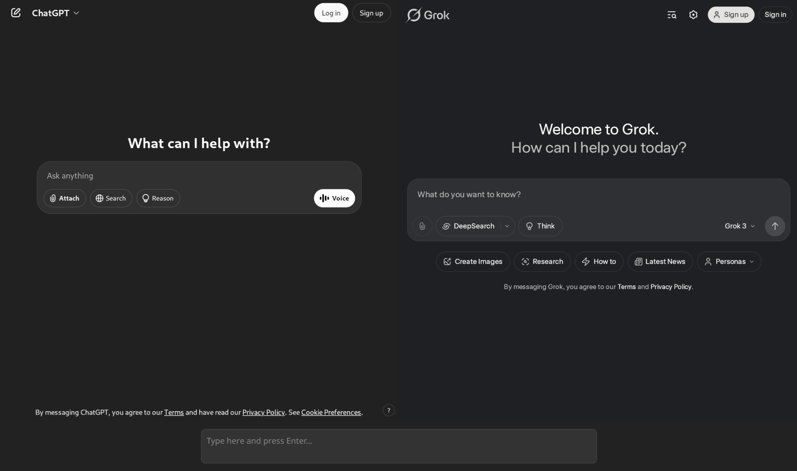

# Ask-AI

**Ask-AI** is a prototype desktop app that lets you chat with multiple LLMs simultaneously - **no API keys required**. It’s built in Rust using [Tao](https://github.com/tauri-apps/tao) and [Wry](https://github.com/tauri-apps/wry).

## 🖼️ Preview

|  |
|:--:|
| *A preview of Ask-AI in action, chatting with multiple LLMs simultaneously.* |

## ✨ Features

- 🧠 Chat with multiple LLMs side by side (currently supports **ChatGPT** and **Grok**)
- 🔐 No API keys required - just run and chat
- ⚡ Lightweight native app built with Rust

## 🚀 Getting Started

Clone the repository and build the app:

```sh
git clone https://github.com/yuxqiu/ask-ai
cd ask-ai
cargo build --release
```

Run the app:

```sh
./target/release/ai
```

## 🛠️ Roadmap

- ✅ **Current**: Basic multi-LLM chat functionality with ChatGPT and Grok
- 🔜 Support for more LLMs, including local models via [Ollama](https://ollama.com/)
- 🔘 Support for file uploads, search, reasoning, and other user interaction buttons
- 🌍 Improve IME support for non-Latin scripts
- 🎨 UI redesign to better manage multiple conversations (browser-like tabbed interface)
- 🧪 Cross-platform testing (Windows, macOS, Linux) and prebuilt release artifacts

## 📄 License

This project is licensed under the [MIT License](./LICENSE).

You're welcome to fork, extend, and contribute to help bring the roadmap to life!

## 🙏 Acknowledgments

Big thanks to the authors of the following projects:

- [AI-MultiPrompt-Extension](https://github.com/bsorrentino/AI-MultiPrompt-Extension/tree/main)